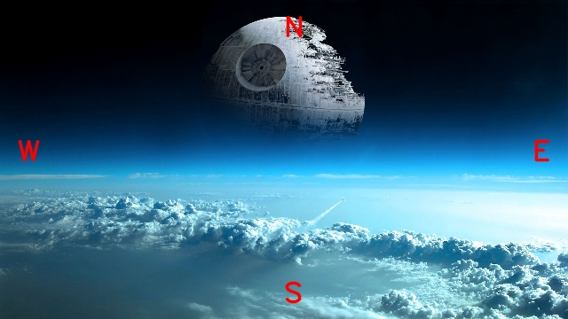
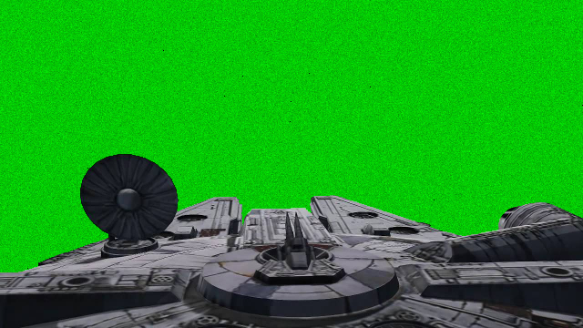
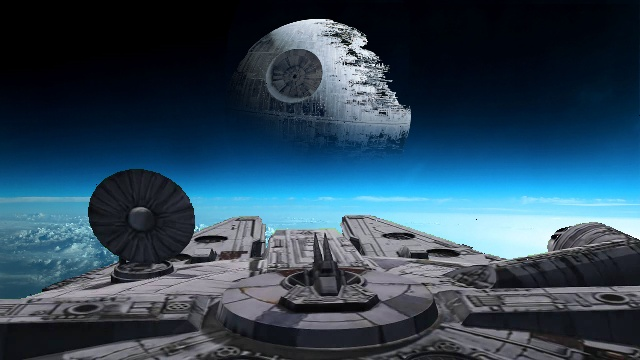

# Digital Image Processing 
## Assignment - 0 ##

Due Date: Thursday, **Feb. 13th**


**1. Image Flipping:**

(10 pts.) Write code to flip an image either horizontally or vertically.

 

The inputs to your function are: (i) image: the image to be flipped (ii) direction: along which the image should be flipped (horizontal/vertical).

  - image_op/operations.py: Edit the function flip
    - Define a new image and populate pixels to flip the input image either horizontally or vertically
    - The horizontally flipped image is shown below. Note that the east and west are reversed but not the north and south.
    -  
    - - The vertical flipped image is shown below. Note that the north and south are reversed but not the east and west.
    - 
    
**2. Chroma Keying:**

(20 pts.) Chroma keying is often used in movies to remove the background in a subject and replace it with another. 
Write code to chroma key the following green screen image of the millennium falcon with a background graphical image that contains the death star.

|        Foreground         |                                                   Backgorund                                                    |
|:-------------------------:|:---------------------------------------------------------------------------------------------------------------:|
 |  |  |

The objective is to create an effect where the spaceship is in the foreground and the death star is in the background.
To do so, you would have to identify green pixels in the foreground image and replace them with the pixel values from the background image.
You will need to compute the Euclidean distance of each pixel in the foreground image to the target green color. If the distance is less than the specified threshold then replace it with the corresponding pixel from the background. 
    
Below is the expected output image.



*Inputs*: The inputs to your function are: (i) a foreground: falcon.png, (ii) background image: dstar.png, (iii) the targeted color ((0, 200, 0) by default) and (iv) a threshold (t = 150 by default). 

  - image_op/operations.py: Edit the function chroma_keying.    
    + Create a result/output image of the same shape as the input color image
    + Calculate the Euclidean distance between every pixel of the color image and the target color.
    + If the distance is smaller than the threshold, copy the background pixel, else copy the foreground pixel to the output image.
      
**Note:**
We are **restricted from importing cv2, numpy, stats, and other third-party libraries,** 
with the only exception of math, importing math library is allowed (import math).

While you can import it for testing purposes, the final submission should not contain the following statements.
- import cv2
- import numpy
- import numpy as np
- import stats
- etc...

The essential functions for the assignment are available in dip module one can import using the following statement
```
import dip
from dip import *
```
The following functions are available

```commandline
from cv2 import namedWindow, imshow, waitKey, imwrite, imread
from cv2 import putText, LINE_AA, FONT_HERSHEY_SIMPLEX

from numpy import zeros, ones, array, shape, arange
from numpy import random
from numpy import min, max, sqrt, sum
from numpy import uint8
from numpy import inf
from numpy.fft import fft2
```

*Assignments that contain any files that import these libraries will not be graded.* 
*Assignments that modify the dip.py file will not be graded.*
   
  - Please do not change the code structure
  - Usage Examples:
   
      - python dip_hw0.py 
      - python dip_hw0.py -tc 10 250 12
      - python dip_hw0.py -fd vertical
   
  

  - Please make sure the code runs when you run the above command from the prompt/terminal
  - All the output images and files are saved to the "output/" folder

Two images are provided for testing: blackwhite_image.png and color_image.png
  
PS. Please do not change dip.py, dip_hw0.py, requirements.txt, and Jenkinsfile. 

    
| No. | Description   | Pts |
|-----|---------------| ------|
| 1.  | Flipping      | 10 Pts.|
| 2.  | Chroma Keying | 20 Pts.|
| | **Total** | **30 Pts.** |

-----------------------

<sub><sup>
License: Property of Quantitative Imaging Laboratory (QIL), Department of Computer Science, University of Houston. This software is property of the QIL, and should not be distributed, reproduced, or shared online, without the permission of the author This software is intended to be used by students of the digital image processing course offered at the University of Houston. The contents are not to be reproduced and shared with anyone without the permission of the author. The contents are not to be posted on any online public hosting websites without the permission of the author. The software is cloned and is available to the students for the duration of the course. At the end of the semester, the GitHub organization is reset, and hence all the existing repositories are reset/deleted, to accommodate the next batch of students.
</sub></sup>


